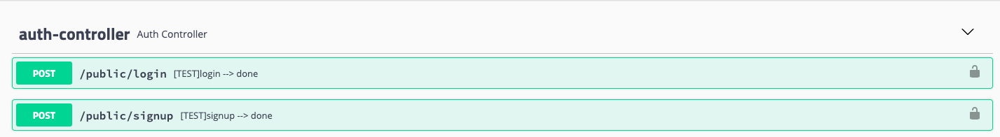
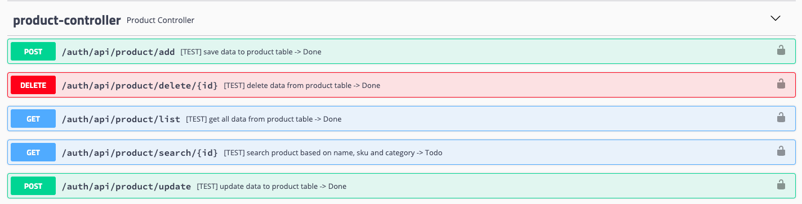
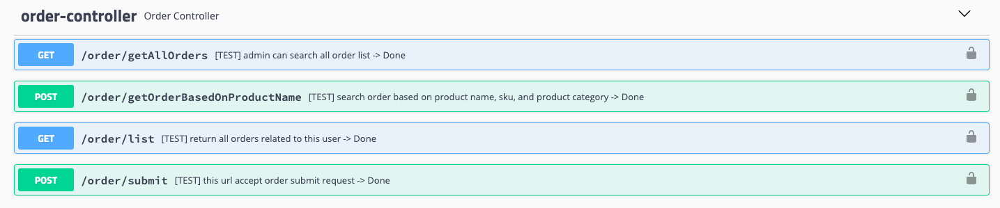

## Swagger API End points

### Auth

### Product

### Order

+ Change Log
  - **app** is main application
  - **coreweb** added as a dependency
  - **auth** added as a dependency
  - **email** added as a dependency
  - Docker script is moved to **app** module
  - added docker-composer
  - enhanced code quality
  - update business logic
  - curls are share on this file curlList.md
  - swagger end point http://localhost:8081/swagger-ui.html

### How to run the application
> git clone https://github.com/cmabdullah/BookWormV2.git
> 
> cd BookWormV2/app
> 
> docker build -t cmabdullah21/spring-boot-docker-v11 --progress=plain .
> 
> docker-compose -f docker-compose.yml up
> 
> 

